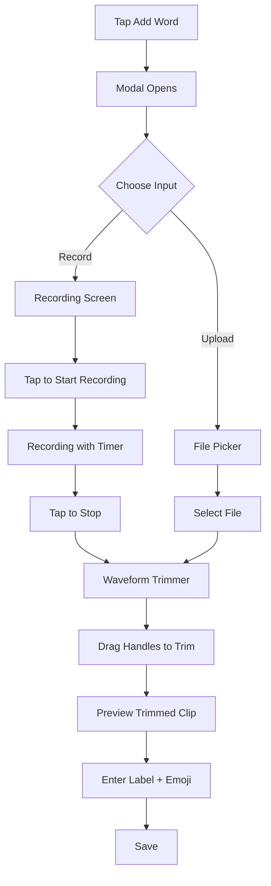
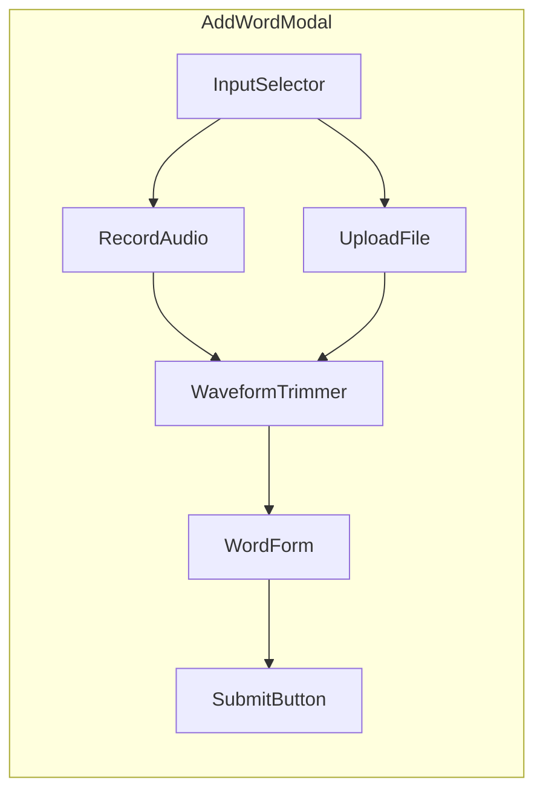

# In-App Recording with Visual Waveform Trimmer

## Overview

Enhance the Add Word flow to support:

1. **Record directly** in the browser using MediaRecorder API
2. **Upload existing files** (current behavior, preserved)
3. **Visual waveform trimmer** to select the exact portion of audio to save

## User Flow



## Technical Approach

### Library Choice: wavesurfer.js

- Mature, well-maintained library (~800KB unpkg, ~50KB gzipped)
- Built-in Regions plugin for trim selection
- Works on iOS Safari and all modern browsers
- React wrapper available: `@wavesurfer/react`

### Component Architecture



**New Components:**

- `AudioInputSelector.tsx` - Toggle between Record / Upload modes
- `AudioRecorder.tsx` - MediaRecorder wrapper with timer UI
- `WaveformTrimmer.tsx` - wavesurfer.js visualization with trim handles

**Modified:**

- `AddWordModal.tsx` - Orchestrate the multi-step flow

## Implementation Details

### 1. Install Dependencies

```bash
npm install wavesurfer.js @wavesurfer/react
```

### 2. AudioRecorder Component

Uses the MediaRecorder API to capture audio:

```typescript
// Key functionality
const mediaRecorder = new MediaRecorder(stream, {
  mimeType: 'audio/webm' // or 'audio/mp4' on Safari
});
mediaRecorder.ondataavailable = (e) => chunks.push(e.data);
mediaRecorder.onstop = () => {
  const blob = new Blob(chunks, { type: 'audio/webm' });
  onRecordingComplete(blob);
};
```

UI includes:

- Large record button (red circle)
- Recording timer (00:00 format)
- Stop button
- Visual feedback (pulsing animation while recording)

### 3. WaveformTrimmer Component

Uses wavesurfer.js with the Regions plugin:

```typescript
import WaveSurfer from 'wavesurfer.js';
import RegionsPlugin from 'wavesurfer.js/dist/plugins/regions';

// Create waveform with draggable region
const regions = wavesurfer.registerPlugin(RegionsPlugin.create());
regions.addRegion({
  start: 0,
  end: duration,
  drag: false,
  resize: true, // Enables trim handles
});
```

UI includes:

- Waveform visualization
- Draggable start/end handles
- Play/pause button for preview
- Current time display
- "Use full clip" reset button

### 4. Audio Trimming (Client-Side)

Trim the audio using Web Audio API before upload:

```typescript
async function trimAudio(blob: Blob, start: number, end: number): Promise<Blob> {
  const audioContext = new AudioContext();
  const arrayBuffer = await blob.arrayBuffer();
  const audioBuffer = await audioContext.decodeAudioData(arrayBuffer);
  
  const startSample = Math.floor(start * audioBuffer.sampleRate);
  const endSample = Math.floor(end * audioBuffer.sampleRate);
  const trimmedLength = endSample - startSample;
  
  const trimmedBuffer = audioContext.createBuffer(
    audioBuffer.numberOfChannels,
    trimmedLength,
    audioBuffer.sampleRate
  );
  
  // Copy samples for each channel
  for (let channel = 0; channel < audioBuffer.numberOfChannels; channel++) {
    const sourceData = audioBuffer.getChannelData(channel);
    const destData = trimmedBuffer.getChannelData(channel);
    for (let i = 0; i < trimmedLength; i++) {
      destData[i] = sourceData[startSample + i];
    }
  }
  
  // Encode back to blob (using OfflineAudioContext or MediaRecorder)
  return encodeAudioBuffer(trimmedBuffer);
}
```

### 5. Updated AddWordModal Flow

The modal becomes a multi-step wizard:

| Step | Content |

|------|---------|

| 1 | Choose: Record new / Upload existing |

| 2a | Recording UI (if record chosen) |

| 2b | File picker (if upload chosen) |

| 3 | Waveform trimmer with preview |

| 4 | Label + Emoji form (existing UI) |

Navigation: Back button to return to previous step, progress indicator at top.

## File Changes

| File | Change |

|------|--------|

| `package.json` | Add `wavesurfer.js`, `@wavesurfer/react` |

| `components/AudioInputSelector.tsx` | New - Record/Upload toggle |

| `components/AudioRecorder.tsx` | New - MediaRecorder wrapper |

| `components/WaveformTrimmer.tsx` | New - wavesurfer.js trimmer |

| `lib/audioUtils.ts` | New - Trimming and encoding utilities |

| `components/AddWordModal.tsx` | Refactor to multi-step wizard |

## Browser Compatibility

| Feature | iOS Safari | Chrome | Firefox |

|---------|------------|--------|---------|

| MediaRecorder | 14.3+ | Yes | Yes |

| Web Audio API | Yes | Yes | Yes |

| wavesurfer.js | Yes | Yes | Yes |

Note: Safari uses `audio/mp4` for MediaRecorder, others use `audio/webm`. The trimming logic handles both.

## UI Styling

All new components will follow the existing amber/orange warm theme:

- Amber gradients for backgrounds
- Rounded corners (2xl/3xl)
- Soft shadows
- Consistent with current card and button styling